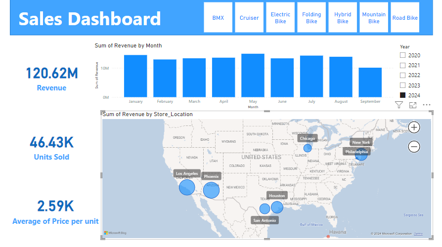
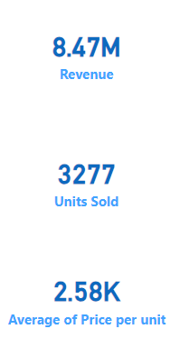
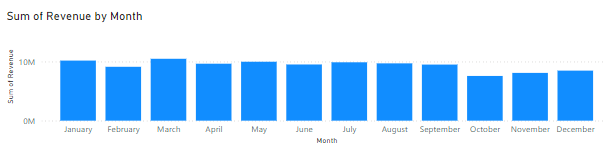
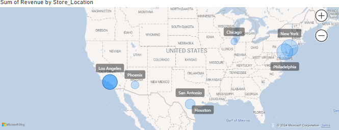

# Bike Sales Analysis in USA

## Table of Contents

- [Project Overview](#project-overview)
- [Data Sources](#data-sources)
- [Data Analysis and Visualisation](#data-analysis-and-visualisation)
- [Recommendations](#recommendations)
  
## Project Overview
---

this data analysis project showcase my experience in handling data for analysing, by analysing various aspects of the sales data we get deeper understanding Key Performance Indicators to make data driven recommendations.

### Dashboard

## Data Sources

- Sales data : the main dataset used for this analyzis project is 'index.csv' file, This dataset contains detailed records from 2020 to September 2024 time of bike sales from United States, capturing detailed sales transactions for a bike store chain.
  
## Tools
- Excel 
- PowerBI

## Data Cleaning/Preparation

In the initial data preparation phase, we performed the following tasks:
- Data loading and inspection.
- Handling missing values.
- Data cleaning and formatting.

## Exploratory Data Analysis

EDA involved exploring the sales data to answer key questions, such as:

- What is the overall sales trend?
- Which state has more sales?
- What are the peak sales periods?

## Data Analysis and Visualisation

### Revenue

### Monthly Revenue

### States Revenue

## Results/Findings

The analysis results are summarized as follows:
1. The Sales have been steadily decreasing over the past year, with a noticeable peak during May month.
2. Electric Bike is the best-performing product in terms of sales and revenue in the past year.
3. Phoednix, Chicago and Los Angeles accounted for the majority of sales decrease among store location.

## Recommendations

Based on the analysis, we recommend the following actions:
- Invest in marketing and promotions during peak sales months to maximize revenue.
- Focus on expanding and promoting Electric Bikes.

